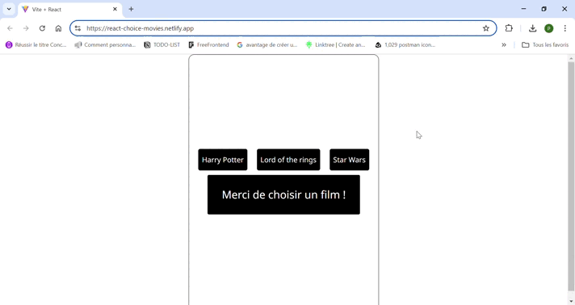

# React Film

## Resume

Creation of the React (+ Vite.js) responsive Front-End Choice Movie using a JSON file.

when clicked to select a film, the user will see the actors of the selected film.

## Requirements

Integrated development environment used: Visual Studio Code

### Commands used to create and launch the project

- Using the **yarn** package = npm install -g yarn. To avoid conflicts, always install dependencies with **yarn add** and not with npm install.

- Initializing the React project with vite.js :

1. yarn create vite react-films --template react
2. cd react-films
3. yarn (install dependencies listed in package.json)
4. yarn dev (project launch)

## Local project setup

1. git@github.com:pricilliaedou/react-films.git
2. yarn
3. yarn dev

## Build with

### Langages

- HTML
- CSS
- Javascript

### Libraries

- **React**
- **Vite.js** : compiler (bundler): bundles multiple source files, such as JavaScript, CSS and other file types, into a single file optimized for production.

### Tools

- **ESLint** : popular tool used in software development to ensure the quality of JavaScript code

## Links

- To see the site : https://react-choice-movies.netlify.app/

  deployment of the site on Netlify (https://docs.netlify.com/)

- To see code : https://github.com/pricilliaedou/react-films

## Demo

.
